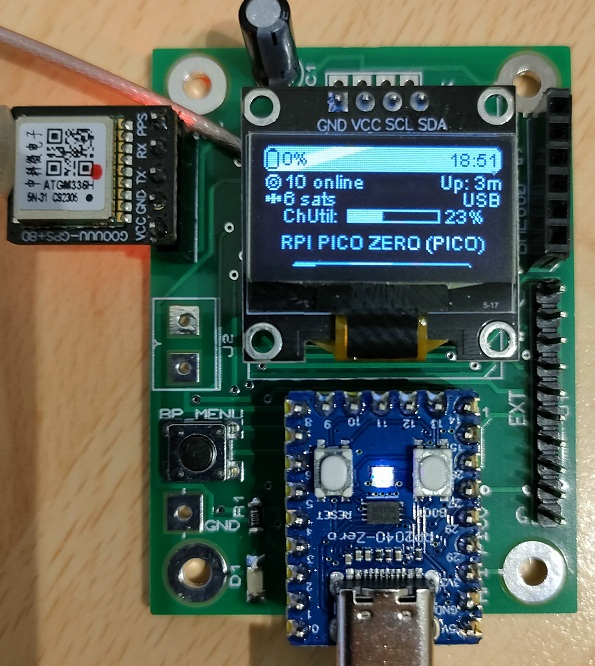
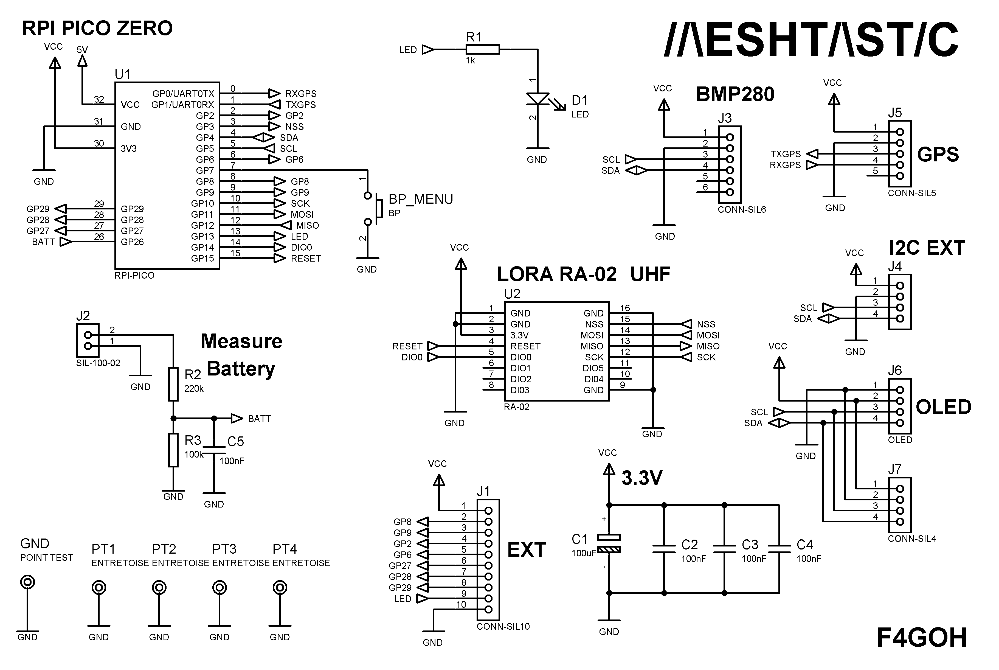
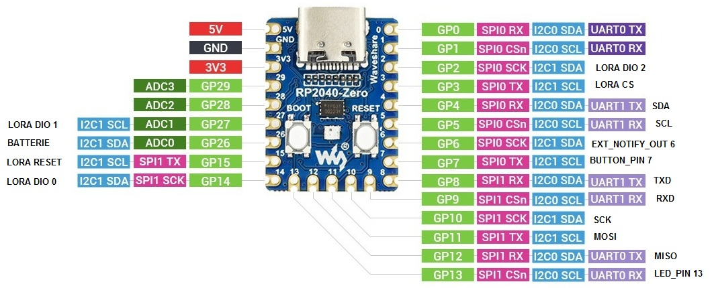
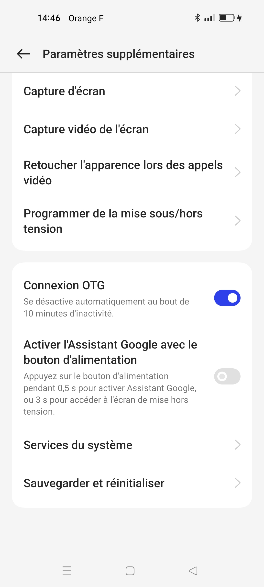
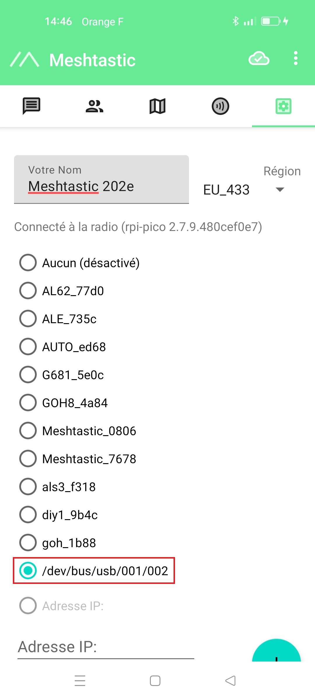
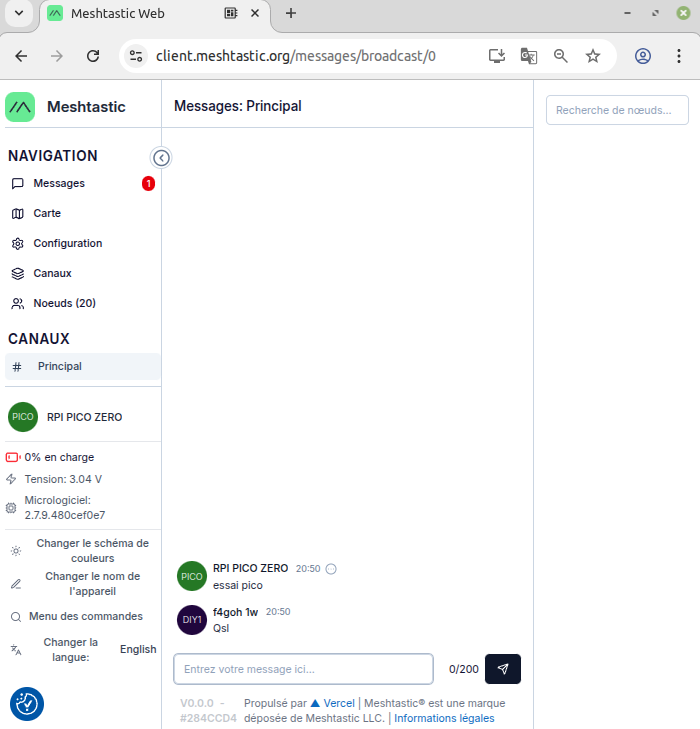
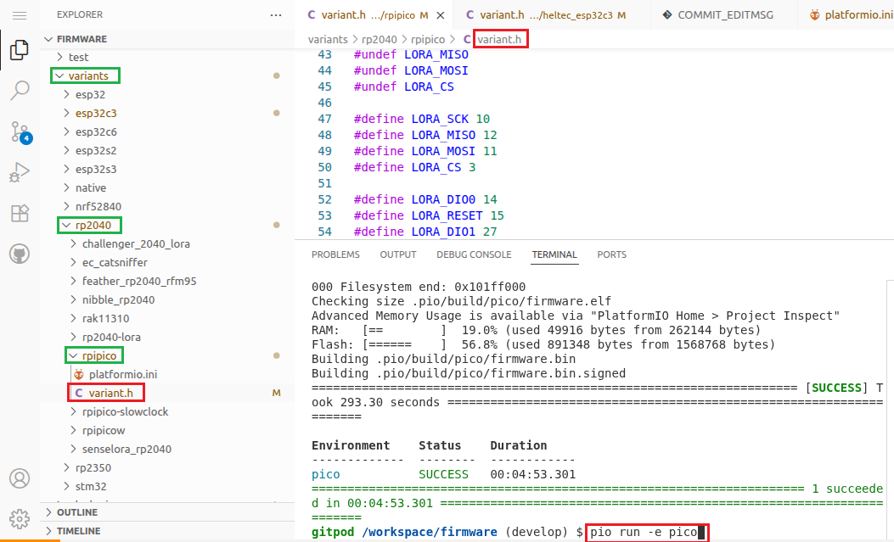
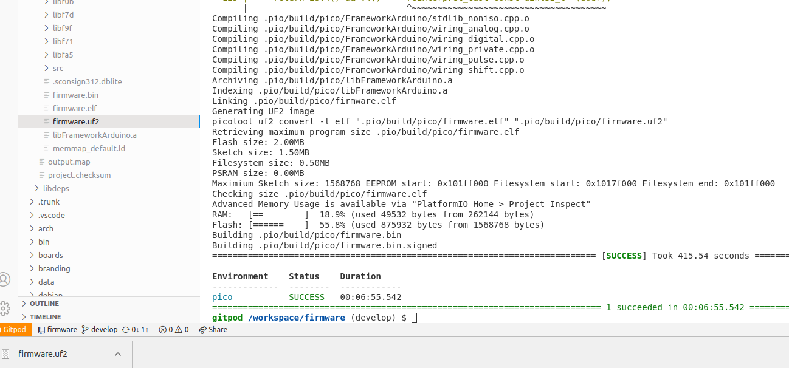
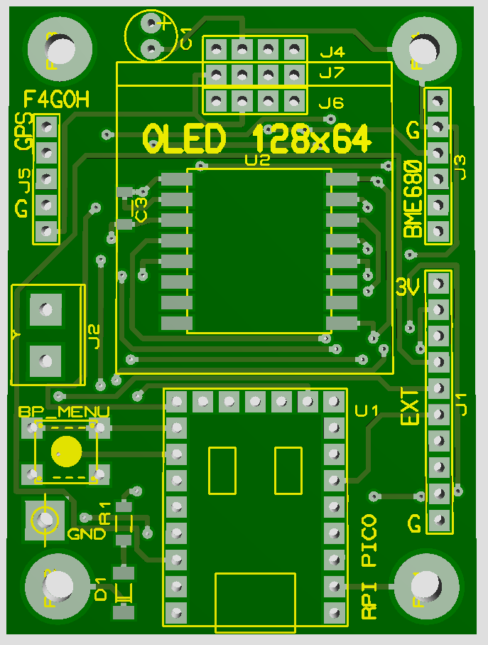

# Mesh-Pico

Make your own Meshtastic project with an RP2040 PICO ZERO



## Schématics



## RPI RP2040 PICO ZERO PINOUT




## Flashing the Pico with firmware.uf2

1. **Hold down the BOOTSEL button** on the Pico.
2. **Connect the USB cable** to your computer while keeping the BOOTSEL button pressed.
3. **Once connected, release the button.** The Pico will appear as a USB drive named `RPI-RP2`.
4. **Drag and drop the `firmware.uf2` file** into this USB drive.
5. The Pico will **automatically reboot and run the software**.
6. The **OLED display should show the frequency selection menu** (choose `EU_433` for the RA-02 module).

## Using smartphone with OTG





## Using smartphone with client.meshtastic.org



# Recompiling Meshtastic Firmware for RP2040

## Step 1: Watch the Tutorial
Watch the video by RichBlackHat:  
[RichBlackHat - Meshtastic RP2040 Compilation Guide](https://www.youtube.com/watch?v=CTNXBvOog2I)

## Step 2: Prepare Your GitHub Account
Before recompiling, make sure you have a **personal GitHub account**.

## Step 3: Launch Gitpod
Open the following link in your browser:  
[https://gitpod.io/#https://github.com/meshtastic/firmware](https://gitpod.io/#https://github.com/meshtastic/firmware)

Once logged in with your GitHub account, Gitpod will automatically **fetch the Meshtastic source files**.  
After loading, a **sidebar will appear** showing all the source files.



## Step 4: Locate the `variant.h` File
Navigate to the following directory: variants/rp2040/rpipico/

Inside, you'll find the `variant.h` file, which defines the **GPIO connections** between the microcontroller and its peripherals.  
Replace its contents with the **new board definition** (copy-paste the updated configuration).

## Step 5: Compile the Firmware
In the command prompt, type the following command:

```bash
pio run -e pico
```

Once completed, the firmware.uf2 file will be located in: .pio/build/pico/src

Follow the flashing procedure described earlier to upload the firmware to your RP2040 device.



## PCB

 

The printed circuit board is manufactured by [JLCPCB](https://jlcpcb.com/)

JLCPCB is renowned for its exceptional PCB quality, precise manufacturing, and reliable tracking services.

Their boards undergo strict quality control, ensuring durability and flawless performance for both prototypes and mass production. Customers can monitor the fabrication process in real time, from file review to production progress.

# Steps to Order a Printed Circuit Board (PCB)

## 1. Prepare Your Files
- **Gerber files**: download gerber file as ZIP file

## 2. Manufacturer is [JLCPCB](https://jlcpcb.com/)

## 4. Upload Your File
- Send your Gerber and drill files to the [JLCPCB](https://jlcpcb.com/) website.
- Use their preview tool to check everything is correct.


## 3. Configure Your Order
- **Dimensions**: length, width, thickness.
- **Number of layers**: single-sided, double-sided, or multilayer.
- **Material**: standard FR4 or other.
- **Finish**: HASL, ENIG, etc.
- **Quantity**: prototypes or mass production.
- **Solder mask color**: green, red, blue, black…


## 5. Confirm and Pay
- Review the quote and selected options.
- Proceed with online payment.


## 6. Track and Receive
- Follow the production progress on the [JLCPCB](https://jlcpcb.com/) website.
- Receive your PCBs and use them.


## Environement boards supported by the command

```bash
pio run -e [name]
```

| Name                         | Name                        | Name                          |
|-----------------------------------|------------------------------------|------------------------------------|
| seeed_xiao_nrf52840_e22_900m30s   | unphone-tft                        | buildroot                          |
| heltec-ht62-esp32c3-sx1262        | picow                              | rak4631                            |
| hackerboxes-esp32-io              | ME25LS01-4Y10TD_e-ink              | t-echo                             |
| nibble-rp2040                     | nugget-s2-lora                     | makerpython_nrf52840_sx1280_eink  |
| pico2                             | native-tft                         | rak2560                            |
| tracksenger-oled                  | t-echo-inkhud                      | heltec_capsule_sensor_v3          |
| hackerboxes-esp32c3-oled          | nrf52_promicro_diy_xtal           | rak4631_nomadstar_meteor_pro_dbg  |
| heltec-hru-3601                   | radiomaster_900_bandit_nano        | tbeam-s3-core                      |
| native-sdl                        | wio-tracker-wm1110                 | thinknode_m1                       |
| pico2w                            | elecrow-adv-35-tft                 | station-g1                         |
| heltec_sensor_hub                 | TWC_mesh_v4                        | seeed_xiao_nrf52840_e22_900m33s   |
| WashTastic                        | bpi_picow_esp32_s3                 | heltec-mesh-pocket-5000-inkhud    |
| nrf52_promicro_diy-inkhud        | tlora-v1                           | seeed_wio_tracker_L1_eink-inkhud  |
| heltec-vision-master-e290        | monteops_hw1                       | heltec-vision-master-e213-inkhud  |
| rak3312                           | meshtastic-dr-dev                  | picomputer-s3-tft                  |
| nano-g1                           | xiao_ble                           | heltec-wireless-tracker           |
| t-echo-lite                       | rp2040-lora                        | makerpython_nrf52840_sx1280_oled  |
| my-esp32s3-diy-eink              | crowpanel-esp32s3-2-epaper         | thinknode_m2                       |
| crowpanel-esp32s3-4-epaper        | crowpanel-esp32s3-5-epaper         | rak_wismesh_tap_v2-tft            |
| wiphone                           | tlora-v2-1-1_6-tcxo                | radiomaster_900_bandit_micro      |
| meshtastic-diy-v1_1              | feather_diy                        | seeed-xiao-nrf52840-wio-sx1262    |
| link32-s3-v1                     | hydra                              | CDEBYTE_E77-MBL                    |
| nano-g2-ultra                    | rak4631_eth_gw_dbg                 | t-energy-s3_e22                    |
| seeed_xiao_nrf52840_kit          | ESP32-S3-Pico                      | meshlink_eink                      |
| mesh-tab-3-5-IPS-resistive       | heltec-v2_0                        | meshlink                           |
| rak4631_dbg                      | heltec-mesh-solar                  | tlora-t3s3-epaper                  |
| heltec-wireless-tracker-V1-0    | dreamcatcher                       | m5stack-cores3                     |
| thinknode_m1-inkhud              | pca10059_diy_eink                  | tlora-pager                        |
| pico_slowclock                   | wio-e5                             | seeed-sensecap-indicator          |
| radiomaster_900_bandit          | m5stack-stamp-c3                   | rak4631_eink                       |
| 9m2ibr_aprs_lora_tracker         | CDEBYTE_EoRa-S3                    | t-deck                             |
| tlora-t3s3-epaper-inkhud         | rak4631_eink_onrxtx                | betafpv_900_tx_nano                |
| EBYTE_ESP32-S3                   | station-g2                         | heltec-wireless-bridge            |
| rak3172                          | seeed_wio_tracker_L1_eink         | heltec-vision-master-e213         |
| mesh-tab-3-2-IPS-resistive       | esp32c3_super_mini                 | picomputer-s3                      |
| seeed-sensecap-indicator-tft     | trackerd                           | ms24sf1                            |
| heltec-mesh-pocket-10000-inkhud | nugget-s3-lora                     | native-tft-debug                   |
| rak11200                         | meshtiny                           | tracker-t1000-e                    |
| mesh-tab-3-2-IPS-capacitive      | m5stack-core                       | chatter2                           |
| wio-sdk-wm1110                   | tlora-pager-tft                    | rak_wismeshtap                     |
| feather_rp2040_rfm95            | tracksenger-lcd                    | heltec-vision-master-e290-inkhud  |
| nano-g1-explorer                | my-esp32s3-diy-oled                | tlora-v2                           |
| heltec-vision-master-t190       | icarus                             | tlora-t3s3-v1                      |
| betafpv_2400_tx_micro           | wio-t1000-s                        | rak11310                           |
| tlora_v1_3                      | tlora-v2-1-1_6                     | heltec-v1                          |
| tracksenger                     | heltec-mesh-node-t114-inkhud       | ME25LS01-4Y10TD                    |
| heltec-mesh-pocket-10000        | thinknode_m5                       | heltec-mesh-node-t114             |
| dreamcatcher-2206               | tlora-v3-3-0-tcxo                  | heltec-wireless-paper-inkhud      |
| mesh-tab-3-5-TN-resistive       | __pico__                           | heltec-wireless-paper              |
| rak4631_nomadstar_meteor_pro    | tlora-c6                           | catsniffer                         |
| t-watch-s3                      | heltec-wsl-v2_1                    | heltec-wireless-paper-v1_0        |
| gat562_mesh_trial_tracker       | unphone                            | m5stack-coreink                    |
| heltec-v2_1                     | senselora_rp2040                   | t-eth-elite                        |
| t-deck-tft                      | mesh-tab-4-0-IPS-capacitive        | native                             |
| ai-c3                           | heltec-v3                          | elecrow-adv1-43-50-70-tft          |
| mesh-tab-3-2-TN-resistive       | coverage                           | tbeam                              |
| seeed_wio_tracker_L1            | tlora-v2-1-1_8                     | seeed_solar_node                   |
| t-deck-pro                      | canaryone                          | challenger_2040_lora              |
| seeed-xiao-s3                   | mesh-tab-3-5-IPS-capacitive        | tbeam0_7                           |
| nrf52_promicro_diy_tcxo         | heltec-mesh-pocket-5000            | nibble-esp32                       |
| elecrow-adv-24-28-tft           | native-fb                          | rak4631_eth_gw                     |
| rak_wismeshtag                  | meshtastic-diy-v1                  | heltec-wsl-v3                      |


